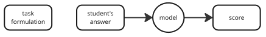
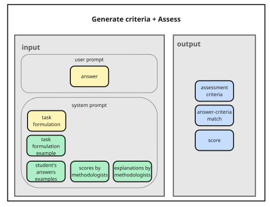
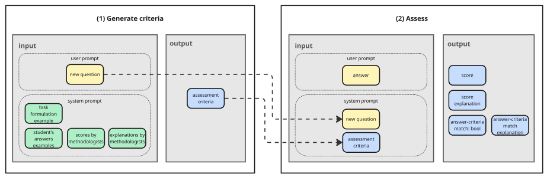
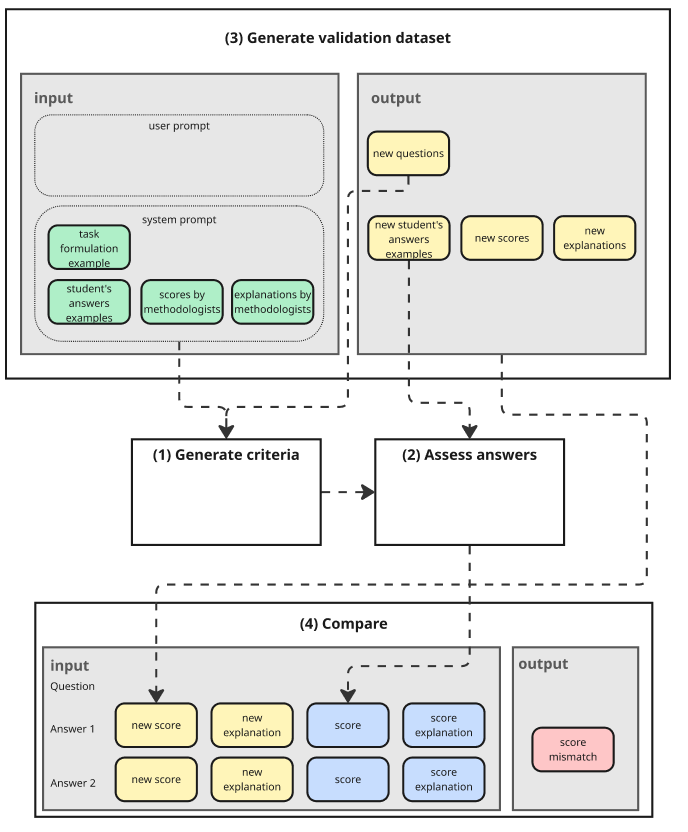

# Students' Answers Assessor

**Table of Contents**
- [Task](#task)
- [Approaches](#approaches)
    - [Approach 1: one step classification](#approach-1-one-step-classification)
    - [Approach 2: two steps classification](#approach-2-two-steps-classification)
– [Next steps](#next-steps-improvments)

## Task
The task was following

```
The student was asked the following question: 

"Imagine you are a data scientist at a mid-sized e-commerce 
company aiming to boost customer retention. Describe how LTV insights
can help formulate actionable customer retention strategies for this company."

There is some model that scores students' answers from 0 to 1. 
We need to reverse engineer and build the same model that would return 
the same scores on such answers of students given the provided 
    – answer examples
    – their scores assigned by methodologists
    – explanation of the scores by methodologists
```


##  Approaches
I developped two approaches

### Approach 1: one step classification


Pros:
* Simple: 1 system prompt + 1 user prompt (with answer)

Cons:
* Each time we run this setting, criteria may differ (which results into different criteria for the same question)

### Approach 2: two steps classification


Pros:
* Single set of assessment criteria per question => consistent scoring of all answers
* Assessment criteria generated automatically based on examples manually labeled by methodologists

Cons:
* More complex: 2 steps + more calls required

Extras:
* Automatic generation of validation dataset based on examples manually labeled by methodologists




Considerations:
* Model output scores may differ from run to run. It may be good to run scoring multiple times, do majority voting and use this score to compare with reference score
* Try to explicitly define how number of matched criteria translate to score

## Next steps (improvments)
1. Implement async openai calls to speed up  answers' processing (parallelization). But should be limited to not face the OpenAIs API rate limits
2. Implement majority voting for scorers  to increase scores stability
3. Add logic to the scoring prompt that "deterministically" translates number of matched criteria into score
4. Store question evaluation criteria in a map to avoid recomputing it for each evaluation call (in-memory storage in inference)
5. Clean up code structure: type hints, classes, unit tests, etc.

## Repo Structure
```
tripleten_assignment/
├── configs/                             # <== folder with configuration files
│   ├── configs.py                       # <== access to open_ai api
│   ├── examples_for_prompt.py           # <== students' answers assessment examples used in prompts
│   └── prompts.py                       # <== all prompts for both approaches
├── data/                                # <== folder containing test and validation data
│   ├── examples_test.py
│   └── validation_dataset.py   
├── results                              # <== folder to store outputs
│   ├── assessment_criteria.csv          # <== file with questions associated with assessment criteria
│   └── validation_results.py            # <== file with assessment run on validation dataset
├── src                                  # <== containing all functions
│   ├── assessor.py                      # <== assessment functions
│   ├── helpers.py                       # <== functions to call open_ai, save and display artefacts
│   ├── parser.py                        # <== functions parsing output strings to data structures
│   └── __init__.py
├── .env                                 # <== put your OPENAI_API_KEY here
├── data_models.py                       # <== data models for assessment and validation dataset
├── research.ipynb                       # <== research notebook: run assessment & create val dataset
.
.
.
├── docs/ 
└── README.md
```


## Installation
**Prerequisites:** 
* Python version 3.12 (it's worth using [pyenv](https://github.com/pyenv/pyenv?tab=readme-ov-file#installation) to install it)
* [Poetry](https://python-poetry.org/docs/#installing-with-the-official-installer) version `2.1.2`

**Local Project Setup**
* Unzip the project
* Navigate to the directory `cd tripleten_assignment`
* Install dependencies `make install`
* Add your OpenAI API key to `.env` file located in root

That's it, you can run assessment functions from `research.ipynb` jupiter notebook 
